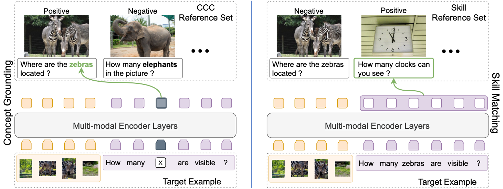

# Separating Skills and Concepts for Novel VQA

This repository contains the PyTorch code for the CVPR 2021 paper: [Separating Skills and Concepts for Novel Visual Question Answering](https://arxiv.org/abs/2107.09106). 



## Citation

If you find this repository useful in your research, please consider citing:

```
@inproceedings{whitehead2021skillconcept,
  author = {Whitehead, Spencer and Wu, Hui and Ji, Heng and Feris, Rogerio and Saenko, Kate},
  title = {Separating Skills and Concepts for Novel Visual Question Answering},
  booktitle = {Proceedings of the IEEE Conference on Computer Vision and Pattern Recognition (CVPR)},
  pages = {5632--5641},
  year = {2021}
}
```

## Setup

#### Requirements

- [Python](https://www.python.org/downloads/) >= 3.6
- [PyTorch](http://pytorch.org/) >= 1.6.0 with CUDA
- [SpaCy](https://spacy.io/) >= 2.3.2 and download/install `en_vectors_web_lg` to obtain the [GloVe](https://github.com/explosion/spacy-models/releases/download/en_vectors_web_lg-2.1.0/en_vectors_web_lg-2.1.0.tar.gz) vectors
- PyYAML


#### Data Download and Organization

To setup the visual features, question files, and annotation files, please refer to the ['Setup' portion of the MCAN repository](https://github.com/MILVLG/mcan-vqa#setup) (under `Prerequisites`). Follow this procedure exactly, until the `datasets` directory has the structure shown in their repository. 

## Concept and Reference Set Preprocessing

The scripts for running the concept discovery and reference set preprocessing yourself will be added to this repository. For the time being, we provide preprocessed files that contain concepts, skill labels (if applicable), and reference sets for each question:

- [train2014 and val2014 files with concepts and skill labels](https://drive.google.com/file/d/1WS6SOxmgzUxADmHXxlGzVc2KYjGf2Nzw/view?usp=sharing): This does not include reference sets and can be used for novel composition evaluation, even independently of this repository.
- [train2014 and val2014 question files with concepts, skill labels, and reference sets](https://drive.google.com/file/d/1j6xejSs_zcCcq1HJHalk-lxMfbtHCzg5/view?usp=sharing): This is the same as the above, but it includes reference sets and should be used when running the code for our approach.

You should decompress the zip file and place the JSON files in the `datasets/vqa` directory:
```angular2html
|-- datasets
    |-- coco_extract
    |   |-- ...
    |-- vqa
    |   |-- train2014_scr_questions.json
    |   |-- train2014_scr_annotations.json
    |   |-- val2014_sc_questions.json
    |   |-- val2014_sc_annotations.json
    |   |-- ...
```


## Training

The base of the command to run the training is:

```bash
python run.py --RUN train ...
```

Some pertinent arguments to add are:
 
- ```--VERSION```: the model/experiment name that will be used to save the outputs.

- ```--MODEL={'small', 'large'}```: whether you want to use a small or large transformer model (see `cfgs/small_model.yml` or `cfgs/large_model.yml` for details). In the paper, use `small`, which is the default.

- ```--USE_GROUNDING=True```: whether to utilize our concept grounding loss. Default is `True`

- ```--CONCEPT```: specifies which concepts should not have any labeled data appear in training (e.g., `--CONCEPT vehicle,car,bus,train`). When used in combination with `--SKILL`, then the composition of the specified skill and concept(s) have their labeled data removed from training. For example, if we have `--SKILL count` and `--CONCEPT car,bus,train`, then the labels for compositions of counting and `car,bus,train` will not be used.  

- ```--SKILL_CONT_LOSS=True```: whether utilize our skill matching loss. Note: `USE_GROUNDING` must be `True` in order to use the skill matching loss in the current implementation.

- ```--SKILL```: specifies which skill for the skill-concept composition(s) should not have any labeled data appear in training (e.g., `--SKILL count`).


During training, the lastest model checkpoints are saved to `ckpts/ckpt_<VERSION>/last_epoch.pkl` and the training logs are saved to `results/log/log_run_<VERSION>.txt`. Validation predictions after every epoch will be saved in the `results/cache/` directory. Additionally, accuracies on novel compositions (or novel concepts) are also evaluated after each epoch.

## Evaluating Novel Compositions/Concepts

While performance on novel compositions/concepts are evaluated after every epoch, they can also be evaluated separately.

Given a file containing the model predictions on the val2014 data (in the [VQA v2 evaluation format](https://visualqa.org/evaluation.html)), run the following to get results on the novel compositions/concepts:
```bash
python run.py --RUN valNovel --RESULT_EVAL_FILE <PREDICTION_FILE> --CONCEPT <LIST_OF_CONCEPTS> --SKILL <SKILL>
```
where `--CONCEPT` and `--SKILL` should be the same as the held out compositions/concepts from training (i.e., exact same arguments). If both, `--CONCEPT` and `--SKILL` are supplied, then that novel skill-concept composition is evaluated. If only, `--CONCEPT` is supplied, then that novel concept is evaluated.

To obtain a file with model predictions, run: 

```bash
python run.py --RUN val --CKPT_PATH <PATH_TO_MODEL_CKPT>
```

## Acknowledgements

This repository is adapted from the [MCAN](https://github.com/MILVLG/mcan-vqa) repository. We thank the authors for providing their code.
